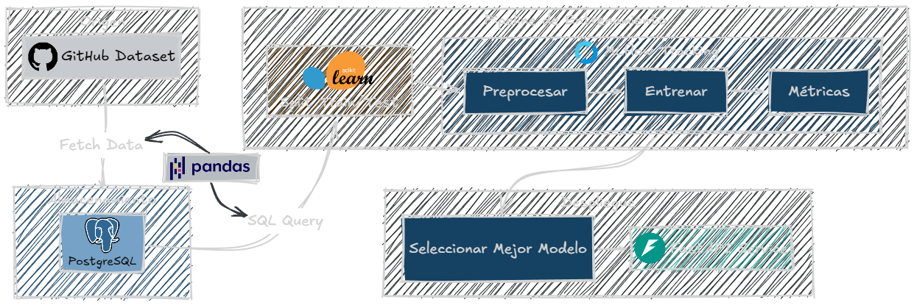

# Medical Insurance Cost Predictor - MLOps Pipeline

Proyecto MLOps de extremo a extremo para la predicción de costos de seguros médicos utilizando modelos de Scikit-learn, tracking en MLflow y despliegue local con Docker Compose y FastAPI.

## Arquitectura del Proyecto



---

## Requisitos Previos

* Python 3.12
* Docker y Docker Compose
* Entorno virtual de Python instalado (`.venv`)

---

## Cómo ejecutar el proyecto paso a paso

### Paso 1: Iniciar el servidor de MLflow
Inicia el servidor local de MLflow ejecutando el comando:

```powershell
$env:MLFLOW_SERVER_ALLOWED_HOSTS="*"
mlflow server --backend-store-uri sqlite:///mlflow.db --default-artifact-root ./mlartifacts --host 0.0.0.0 --port 5000
```

El servidor quedará disponible en http://localhost:5000.

### Paso 2: Levantar el ecosistema (PostgreSQL + API de FastAPI)
En otra consola, levanta el contenedor de la base de datos y compila/inicia el contenedor de la API:
```bash
docker compose up -d --build
```
* La base de datos estará expuesta localmente en el puerto `5433`.
* La API estará expuesta localmente en el puerto `8000`.

### Paso 3: Ingestar los datos en PostgreSQL
Descarga el dataset original e insértalo en la tabla `dataset` de PostgreSQL:
```bash
python loading.py
```

### Paso 4: Entrenar los modelos y comparar en MLflow
Corre el script de entrenamiento para probar diferentes modelos (Linear Regression, Decision Tree y Random Forest) y registrarlos en tu servidor de MLflow:
```bash
python training.py
```
Abre la interfaz de MLflow (http://localhost:5000) y asigna el alias `champion` al modelo con mejor rendimiento.

### Paso 5: Probar la API de FastAPI
Una vez que el modelo esté registrado con el alias `champion`, la API de FastAPI lo cargará automáticamente en memoria. Puedes hacer una predicción enviando un request POST:

**URL:** `http://localhost:8000/predict`  
**Cuerpo de la petición (JSON):**
```json
{
  "age": 25,
  "sex": "female",
  "bmi": 24.3,
  "children": 1,
  "smoker": "no",
  "region": "northwest"
}
```

---

## Ejecutar Pruebas Automatizadas
Para verificar el correcto funcionamiento del servidor FastAPI de forma aislada, ejecuta:
```bash
pytest
```
